# Vertical Slice Development Plan

**Status**: Active Development Plan  
**Last Updated**: 2026-09-30  
**Related Documents**: `ARCHITECTURE.md`, `WHITEBOARD_DESIGN.md`, `ARCHITECTURE_GUARDRAIL.md`

---

## Table of Contents

1. [What is a Vertical Slice?](#1-what-is-a-vertical-slice)
2. [How to Read This Document](#2-how-to-read-this-document)
3. [Slice Dependency Graph](#3-slice-dependency-graph)
4. [Build Order & Parallelization](#4-build-order--parallelization)
5. [Wave 1: Foundation Slices](#5-wave-1-foundation-slices)
6. [Wave 2: Communication Slices](#6-wave-2-communication-slices)
7. [Wave 3: Collaboration Slices](#7-wave-3-collaboration-slices)
8. [Wave 4: Task Management Slices](#8-wave-4-task-management-slices)
9. [Wave 5: Notification Slices](#9-wave-5-notification-slices)
10. [Wave 6: Discovery Slices](#10-wave-6-discovery-slices)
11. [Wave 7: Integration Slices](#11-wave-7-integration-slices)
12. [Wave 8: Whiteboard Slices](#12-wave-8-whiteboard-slices)
13. [Wave 9: Production Slices](#13-wave-9-production-slices)
14. [Mapping: Original Phases → Vertical Slices](#14-mapping-original-phases--vertical-slices)

---

## 1. What is a Vertical Slice?

A **vertical slice** is a complete, end-to-end feature that cuts through every layer of the application:

```
┌─────────────────────────────────────────────────────────┐
│                    VERTICAL SLICE                        │
│                                                          │
│  ┌──────────┐  ┌──────────┐  ┌──────────┐  ┌────────┐ │
│  │   DB     │→ │ Service  │→ │   API    │→ │Realtime│ │
│  │  Layer   │  │  Layer   │  │  Layer   │  │  Layer │ │
│  └──────────┘  └──────────┘  └──────────┘  └────────┘ │
│       ↑                                         │       │
│       └─────────── Frontend ←───────────────────┘       │
└─────────────────────────────────────────────────────────┘
```

**Principles** (from Jimmy Bogard's Vertical Slice Architecture):
- Each slice is a **deliverable, testable, deployable unit of work**
- **Minimize coupling between slices** — slices are independent
- **Maximize coupling within a slice** — all code for a feature lives together
- New features **add code** — they don't modify shared code
- Each slice can choose its own internal patterns (start simple, refactor as needed)

**In this project**, a vertical slice means:
- Database tables + migrations
- Repository implementations
- Service layer logic
- API endpoints (REST + WebSocket)
- Real-time event types
- Tests (unit + integration)
- Documentation

---

## 2. How to Read This Document

Each slice is defined with:

| Field | Description |
|---|---|
| **ID** | Unique identifier (e.g., `VS-01`) |
| **Name** | Human-readable name |
| **Description** | What the slice delivers |
| **Crates Touched** | Which of the 11 crates are modified |
| **Depends On** | Slice IDs that must be completed first |
| **Deliverables** | Concrete outputs (tables, endpoints, events) |
| **Acceptance Criteria** | Testable conditions that must pass |
| **Est. Effort** | Estimated person-days |
| **Source** | Which original phase this maps to |

---

## 3. Slice Dependency Graph

### 3.1 Full Graph (Mermaid)

```mermaid
graph TD
    %% Foundation
    VS01[VS-01: Workspace Scaffolding]
    VS02[VS-02: Database Foundation]
    VS03[VS-03: Core Types & Traits]
    VS04[VS-04: Authentication]
    VS05[VS-05: User Management]
    VS06[VS-06: Organization Management]

    %% Communication
    VS07[VS-07: WebSocket Infrastructure]
    VS08[VS-08: Channels]
    VS09[VS-09: Messages]
    VS10[VS-10: Presence]
    VS11[VS-11: Reactions]
    VS12[VS-12: Typing Indicators]
    VS13[VS-13: Message Threads]
    VS14[VS-14: Direct Messages]
    VS15[VS-15: Pinned Messages]
    VS16[VS-16: Message Edit/Delete]

    %% Collaboration
    VS17[VS-17: File Attachments]
    VS18[VS-18: Rich Text / Markdown]
    VS19[VS-19: @Mentions]

    %% Task Management
    VS20[VS-20: Boards]
    VS21[VS-21: Tasks]
    VS22[VS-22: Task Comments]
    VS23[VS-23: Task Labels]
    VS24[VS-24: Task Due Dates]
    VS25[VS-25: Board Views]
    VS26[VS-26: Task Dependencies]

    %% Notifications
    VS27[VS-27: Notification Center]
    VS28[VS-28: Push Notifications]
    VS29[VS-29: Email Digests]
    VS30[VS-30: Do-Not-Disturb]

    %% Discovery
    VS31[VS-31: Full-Text Search]
    VS32[VS-32: Channel Browser]
    VS33[VS-33: User Directory]

    %% Integrations
    VS34[VS-34: Incoming Webhooks]
    VS35[VS-35: Slash Commands]
    VS36[VS-36: Bot Framework]

    %% Whiteboard
    VS37[VS-37: Whiteboard Foundation]
    VS38[VS-38: Whiteboard Real-Time Collab]
    VS39[VS-39: Whiteboard Tools & UX]
    VS40[VS-40: Whiteboard Export & Versions]
    VS41[VS-41: Whiteboard Performance]

    %% Production
    VS42[VS-42: Rate Limiting]
    VS43[VS-43: Audit Logging]
    VS44[VS-44: Observability]
    VS45[VS-45: CI/CD & Deployment]

    %% Foundation dependencies
    VS01 --> VS02
    VS01 --> VS03
    VS02 --> VS04
    VS03 --> VS04
    VS04 --> VS05
    VS04 --> VS06
    VS05 --> VS06

    %% Communication dependencies
    VS04 --> VS07
    VS06 --> VS08
    VS07 --> VS08
    VS08 --> VS09
    VS07 --> VS10
    VS09 --> VS11
    VS09 --> VS12
    VS09 --> VS13
    VS08 --> VS14
    VS09 --> VS15
    VS09 --> VS16

    %% Collaboration dependencies
    VS09 --> VS17
    VS09 --> VS18
    VS09 --> VS19

    %% Task management dependencies
    VS06 --> VS20
    VS20 --> VS21
    VS21 --> VS22
    VS21 --> VS23
    VS21 --> VS24
    VS20 --> VS25
    VS21 --> VS26

    %% Notification dependencies
    VS09 --> VS27
    VS11 --> VS27
    VS27 --> VS28
    VS27 --> VS29
    VS27 --> VS30

    %% Discovery dependencies
    VS09 --> VS31
    VS08 --> VS32
    VS05 --> VS33

    %% Integration dependencies
    VS09 --> VS34
    VS09 --> VS35
    VS34 --> VS36

    %% Whiteboard dependencies
    VS07 --> VS37
    VS06 --> VS37
    VS37 --> VS38
    VS38 --> VS39
    VS39 --> VS40
    VS40 --> VS41

    %% Production dependencies
    VS09 --> VS42
    VS09 --> VS43
    VS01 --> VS44
    VS44 --> VS45
```



### 3.2 ASCII Dependency Graph

```
WAVE 1: FOUNDATION
═══════════════════
VS-01 Workspace Scaffolding
  ├──→ VS-02 Database Foundation
  │      └──→ VS-04 Authentication ←── VS-03 Core Types & Traits
  └──→ VS-03 Core Types & Traits ──────→ VS-04 Authentication
                                            ├──→ VS-05 User Management
                                            │      └──→ VS-06 Organization Management
                                            └──→ VS-06 Organization Management

WAVE 2: COMMUNICATION
═════════════════════
VS-04 ──→ VS-07 WebSocket Infrastructure
VS-06 ──→ VS-08 Channels ←── VS-07
VS-08 ──→ VS-09 Messages
VS-07 ──→ VS-10 Presence
VS-09 ──→ VS-11 Reactions
VS-09 ──→ VS-12 Typing Indicators
VS-09 ──→ VS-13 Message Threads
VS-08 ──→ VS-14 Direct Messages
VS-09 ──→ VS-15 Pinned Messages
VS-09 ──→ VS-16 Message Edit/Delete

WAVE 3: COLLABORATION
═════════════════════
VS-09 ──→ VS-17 File Attachments
VS-09 ──→ VS-18 Rich Text / Markdown
VS-09 ──→ VS-19 @Mentions

WAVE 4: TASK MANAGEMENT
═══════════════════════
VS-06 ──→ VS-20 Boards
VS-20 ──→ VS-21 Tasks
VS-21 ──→ VS-22 Task Comments
VS-21 ──→ VS-23 Task Labels
VS-21 ──→ VS-24 Task Due Dates
VS-20 ──→ VS-25 Board Views
VS-21 ──→ VS-26 Task Dependencies

WAVE 5: NOTIFICATIONS
═════════════════════
VS-09 ──→ VS-27 Notification Center ←── VS-11
VS-27 ──→ VS-28 Push Notifications
VS-27 ──→ VS-29 Email Digests
VS-27 ──→ VS-30 Do-Not-Disturb

WAVE 6: DISCOVERY
═════════════════
VS-09 ──→ VS-31 Full-Text Search
VS-08 ──→ VS-32 Channel Browser
VS-05 ──→ VS-33 User Directory

WAVE 7: INTEGRATIONS
════════════════════
VS-09 ──→ VS-34 Incoming Webhooks
VS-09 ──→ VS-35 Slash Commands
VS-34 ──→ VS-36 Bot Framework

WAVE 8: WHITEBOARD
══════════════════
VS-07 ──→ VS-37 Whiteboard Foundation ←── VS-06
VS-37 ──→ VS-38 Whiteboard Real-Time Collab
VS-38 ──→ VS-39 Whiteboard Tools & UX
VS-39 ──→ VS-40 Whiteboard Export & Versions
VS-40 ──→ VS-41 Whiteboard Performance

WAVE 9: PRODUCTION
══════════════════
VS-09 ──→ VS-42 Rate Limiting
VS-09 ──→ VS-43 Audit Logging
VS-01 ──→ VS-44 Observability
VS-44 ──→ VS-45 CI/CD & Deployment
```

---

## 4. Build Order & Parallelization

### Wave 1: Foundation (Weeks 1-2) — Sequential

```
Week 1:  [VS-01] → [VS-02, VS-03] (parallel)
Week 2:  [VS-04] → [VS-05, VS-06] (parallel)
```

| Slice | Can Parallelize With | Blocker |
|---|---|---|
| VS-01 | None | None |
| VS-02 | VS-03 | VS-01 |
| VS-03 | VS-02 | VS-01 |
| VS-04 | None | VS-02, VS-03 |
| VS-05 | VS-06 | VS-04 |
| VS-06 | VS-05 | VS-04 |

### Wave 2: Communication (Weeks 3-4) — Partially Parallel

```
Week 3:  [VS-07] → [VS-08, VS-10] (parallel)
Week 4:  [VS-09] → [VS-11, VS-12, VS-13, VS-14, VS-15, VS-16] (parallel)
```

| Slice | Can Parallelize With | Blocker |
|---|---|---|
| VS-07 | None | VS-04 |
| VS-08 | VS-10 | VS-06, VS-07 |
| VS-10 | VS-08 | VS-07 |
| VS-09 | None | VS-08 |
| VS-11 | VS-12, VS-13, VS-15, VS-16 | VS-09 |
| VS-12 | VS-11, VS-13, VS-15, VS-16 | VS-09 |
| VS-13 | VS-11, VS-12, VS-15, VS-16 | VS-09 |
| VS-14 | VS-11, VS-12, VS-13, VS-15, VS-16 | VS-08 |
| VS-15 | VS-11, VS-12, VS-13, VS-16 | VS-09 |
| VS-16 | VS-11, VS-12, VS-13, VS-15 | VS-09 |

### Wave 3: Collaboration (Week 5) — Fully Parallel

```
Week 5:  [VS-17, VS-18, VS-19] (all parallel)
```

### Wave 4: Task Management (Weeks 5-6) — Partially Parallel

```
Week 5:  [VS-20] → [VS-21, VS-25] (parallel)
Week 6:  [VS-22, VS-23, VS-24, VS-26] (all parallel)
```

### Wave 5: Notifications (Week 6) — Partially Parallel

```
Week 6:  [VS-27] → [VS-28, VS-29, VS-30] (parallel)
```

### Wave 6: Discovery (Week 7) — Fully Parallel

```
Week 7:  [VS-31, VS-32, VS-33] (all parallel)
```

### Wave 7: Integrations (Week 7) — Partially Parallel

```
Week 7:  [VS-34, VS-35] (parallel) → [VS-36]
```

### Wave 8: Whiteboard (Weeks 7-10) — Sequential

```
Week 7:  [VS-37]
Week 8:  [VS-38]
Week 9:  [VS-39]
Week 10: [VS-40] → [VS-41]
```

### Wave 9: Production (Week 10-11) — Partially Parallel

```
Week 10: [VS-42, VS-43, VS-44] (parallel)
Week 11: [VS-45]
```

---

## 5. Wave 1: Foundation Slices

### VS-01: Workspace Scaffolding

| Field | Value |
|---|---|
| **ID** | VS-01 |
| **Name** | Workspace Scaffolding & Project Setup |
| **Description** | Initialize the Cargo workspace with all 11 crates, set up workspace dependencies, configure `rustfmt`/`clippy`, create the `app` binary skeleton with Tokio runtime, and establish the crate dependency graph. |
| **Crates Touched** | All (creation only) |
| **Depends On** | None |
| **Source** | ARCHITECTURE.md Phase 1 |

**Deliverables:**
- [ ] Root `Cargo.toml` with `[workspace]` members and `[workspace.dependencies]`
- [ ] All 11 crate directories with `Cargo.toml` and `src/lib.rs`
- [ ] `app/src/main.rs` with Tokio runtime and graceful shutdown
- [ ] `.rustfmt.toml` and `clippy.toml` configuration
- [ ] `rust-toolchain.toml` pinning Rust version
- [ ] `README.md` with build instructions
- [ ] `.env.example` with all required environment variables
- [ ] `docker-compose.yml` for local dev (Postgres, Redis, Meilisearch, MinIO)

**Acceptance Criteria:**
- [ ] `cargo build` succeeds for entire workspace
- [ ] `cargo test` passes (empty test suites)
- [ ] `cargo clippy -- -D warnings` passes
- [ ] `cargo fmt --check` passes
- [ ] `docker-compose up` starts all infrastructure
- [ ] App binary starts and logs "Server ready"

**Est. Effort:** 2 days

---

### VS-02: Database Foundation & Migrations

| Field | Value |
|---|---|
| **ID** | VS-02 |
| **Name** | Database Foundation & Migration System |
| **Description** | Set up SQLx with compile-time checked queries, create the migration system, implement the connection pool, create the base schema with all 17 tables, and establish RLS policies. |
| **Crates Touched** | `db`, `core` |
| **Depends On** | VS-01 |
| **Source** | ARCHITECTURE.md Phase 1 |

**Deliverables:**
- [ ] `db/src/pool.rs` — `PgPool` configuration with connection limits
- [ ] `db/src/transaction.rs` — Transaction helper utilities
- [ ] `db/migrations/0001_initial.sql` — All 17 base tables:
  - [ ] `users`, `organizations`, `org_members`, `invitations`
  - [ ] `sessions`, `audit_logs`
  - [ ] `channels`, `channel_members`, `messages`, `reactions`, `pins`
  - [ ] `boards`, `board_members`, `tasks`, `task_assignees`
  - [ ] `attachments`, `notifications`
- [ ] RLS policies on all multi-tenant tables
- [ ] `db/src/lib.rs` — Re-export all modules
- [ ] Database indexes per conventions (D13-D14)

**Acceptance Criteria:**
- [ ] `cargo sqlx migrate run` applies all migrations cleanly
- [ ] `cargo sqlx migrate revert` rolls back cleanly
- [ ] All tables have `id`, `created_at`, `updated_at` columns
- [ ] All multi-tenant tables have `org_id` column
- [ ] All multi-tenant tables have RLS enabled
- [ ] `#[sqlx::test]` test verifies migration integrity
- [ ] Connection pool handles 100+ concurrent connections

**Est. Effort:** 3 days

---

### VS-03: Core Types, Traits & Error System

| Field | Value |
|---|---|
| **ID** | VS-03 |
| **Name** | Core Domain Types, Repository Traits & Error System |
| **Description** | Define all domain types (User, Org, Channel, Message, etc.), repository traits (interfaces), the `AppError` enum, ID types, and shared event definitions. This is the contract that all other crates depend on. |
| **Crates Touched** | `core` |
| **Depends On** | VS-01 |
| **Source** | ARCHITECTURE.md Phase 1 |

**Deliverables:**
- [ ] `core/src/ids.rs` — `UserId`, `OrgId`, `ChannelId`, `MessageId`, `BoardId`, `TaskId`, `WhiteboardId`
- [ ] `core/src/types/user.rs` — `User`, `UserRole`, `UserStatus`
- [ ] `core/src/types/org.rs` — `Organization`, `OrgMember`, `OrgRole`, `Permission`
- [ ] `core/src/types/channel.rs` — `Channel`, `ChannelType`, `ChannelMember`
- [ ] `core/src/types/message.rs` — `Message`, `MessageType`
- [ ] `core/src/types/board.rs` — `Board`, `BoardMember`
- [ ] `core/src/types/task.rs` — `Task`, `TaskStatus`, `TaskPriority`
- [ ] `core/src/types/notification.rs` — `Notification`, `NotificationType`
- [ ] `core/src/traits/` — Repository traits for each entity
- [ ] `core/src/error.rs` — `AppError` enum with all variants
- [ ] `core/src/events.rs` — Shared event type definitions
- [ ] `core/src/config.rs` — Configuration structs with serde

**Acceptance Criteria:**
- [ ] All types implement `Debug`, `Clone`, `Serialize`, `Deserialize`
- [ ] All ID types are newtype wrappers around `Uuid`
- [ ] `AppError` implements `thiserror::Error` and `IntoResponse`
- [ ] Repository traits are async and return `Result<T, AppError>`
- [ ] All public items have doc comments
- [ ] `cargo doc` generates documentation without warnings

**Est. Effort:** 3 days

---

### VS-04: Authentication & Authorization

| Field | Value |
|---|---|
| **ID** | VS-04 |
| **Name** | Authentication & Authorization System |
| **Description** | Implement JWT-based authentication with access + refresh tokens, Argon2id password hashing, session management, permission checking middleware, and OAuth provider integration points. |
| **Crates Touched** | `auth`, `db`, `api`, `core` |
| **Depends On** | VS-02, VS-03 |
| **Source** | ARCHITECTURE.md Phase 1 |

**Deliverables:**
- [ ] `auth/src/jwt.rs` — JWT token creation, validation, refresh
- [ ] `auth/src/password.rs` — Argon2id hashing and verification
- [ ] `auth/src/session.rs` — Session creation, validation, revocation
- [ ] `auth/src/permissions.rs` — Permission enum, role hierarchy, check functions
- [ ] `auth/src/oauth.rs` — OAuth provider trait and implementations
- [ ] `auth/src/middleware.rs` — Axum middleware for auth extraction
- [ ] `api/src/middleware/auth.rs` — JWT validation middleware
- [ ] `api/src/middleware/org.rs` — Org context extraction middleware
- [ ] REST endpoints:
  - [ ] `POST /api/v1/auth/register`
  - [ ] `POST /api/v1/auth/login`
  - [ ] `POST /api/v1/auth/refresh`
  - [ ] `POST /api/v1/auth/logout`
  - [ ] `POST /api/v1/auth/forgot-password`
  - [ ] `POST /api/v1/auth/reset-password`
- [ ] Integration tests for all auth flows

**Acceptance Criteria:**
- [ ] Register → Login → Access protected endpoint works end-to-end
- [ ] Expired tokens return 401
- [ ] Invalid tokens return 401
- [ ] Refresh token rotation works
- [ ] Password hashing uses Argon2id with secure parameters
- [ ] Sessions are stored in Redis with TTL
- [ ] Logout revokes session
- [ ] Permission checks enforce role hierarchy
- [ ] All endpoints have integration tests
- [ ] Rate limiting on auth endpoints (10 req/min per IP)

**Est. Effort:** 4 days

---

### VS-05: User Management

| Field | Value |
|---|---|
| **ID** | VS-05 |
| **Name** | User Management |
| **Description** | CRUD operations for user profiles, avatar upload, user settings, and user search within an org. |
| **Crates Touched** | `services`, `api`, `db`, `core` |
| **Depends On** | VS-04 |
| **Source** | ARCHITECTURE.md Phase 1 |

**Deliverables:**
- [ ] `services/src/user.rs` — `UserService` with CRUD operations
- [ ] `db/src/repositories/user.rs` — `UserRepository` implementation
- [ ] `api/src/handlers/user.rs` — User HTTP handlers
- [ ] `api/src/dto/user.rs` — User request/response DTOs
- [ ] REST endpoints:
  - [ ] `GET /api/v1/users/me` — Get current user
  - [ ] `PATCH /api/v1/users/me` — Update profile
  - [ ] `GET /api/v1/users/:user_id` — Get user by ID
  - [ ] `GET /api/v1/orgs/:org_id/users` — List org users
  - [ ] `PATCH /api/v1/users/me/avatar` — Upload avatar
  - [ ] `GET /api/v1/users/me/settings` — Get settings
  - [ ] `PATCH /api/v1/users/me/settings` — Update settings
- [ ] Integration tests for all endpoints

**Acceptance Criteria:**
- [ ] All CRUD operations work via REST
- [ ] Users can only access profiles within their org
- [ ] Avatar upload uses pre-signed S3 URLs
- [ ] User search is paginated and filterable
- [ ] All endpoints require authentication
- [ ] Cross-org access returns 403

**Est. Effort:** 3 days

---

### VS-06: Organization Management

| Field | Value |
|---|---|
| **ID** | VS-06 |
| **Name** | Organization & Membership Management |
| **Description** | Organization CRUD, member invitations, role management, guest accounts, and org settings. This establishes the multi-tenant boundary for all future slices. |
| **Crates Touched** | `services`, `api`, `db`, `core` |
| **Depends On** | VS-04, VS-05 |
| **Source** | ARCHITECTURE.md Phase 1 |

**Deliverables:**
- [ ] `services/src/org.rs` — `OrgService` with CRUD operations
- [ ] `db/src/repositories/org.rs` — `OrgRepository` implementation
- [ ] `api/src/handlers/org.rs` — Org HTTP handlers
- [ ] `api/src/dto/org.rs` — Org request/response DTOs
- [ ] REST endpoints:
  - [ ] `POST /api/v1/orgs` — Create organization
  - [ ] `GET /api/v1/orgs/:org_id` — Get org details
  - [ ] `PATCH /api/v1/orgs/:org_id` — Update org
  - [ ] `DELETE /api/v1/orgs/:org_id` — Delete org (owner only)
  - [ ] `GET /api/v1/orgs/:org_id/members` — List members
  - [ ] `POST /api/v1/orgs/:org_id/invitations` — Invite user
  - [ ] `POST /api/v1/orgs/:org_id/invitations/:id/accept` — Accept invite
  - [ ] `PATCH /api/v1/orgs/:org_id/members/:user_id/role` — Change role
  - [ ] `DELETE /api/v1/orgs/:org_id/members/:user_id` — Remove member
  - [ ] `GET /api/v1/orgs/:org_id/settings` — Get settings
  - [ ] `PATCH /api/v1/orgs/:org_id/settings` — Update settings
- [ ] Integration tests for all endpoints
- [ ] Multi-tenancy tests verifying org isolation

**Acceptance Criteria:**
- [ ] Org creation works and creator becomes owner
- [ ] Invitation flow: create → email → accept → membership
- [ ] Role changes enforce permission hierarchy
- [ ] Only owners can delete orgs
- [ ] Members can only see their own org's data
- [ ] Guest accounts have restricted permissions
- [ ] All endpoints validate org membership
- [ ] All queries filter by `org_id`

**Est. Effort:** 4 days

---

## 6. Wave 2: Communication Slices

### VS-07: WebSocket Real-Time Infrastructure

| Field | Value |
|---|---|
| **ID** | VS-07 |
| **Name** | WebSocket Real-Time Infrastructure |
| **Description** | Build the WebSocket server with connection management, heartbeat, the typed `RealtimeEvent` enum, Redis pub/sub fan-out, and connection authentication. This is the foundation for all real-time features. |
| **Crates Touched** | `realtime`, `core`, `api` |
| **Depends On** | VS-04 |
| **Source** | ARCHITECTURE.md Phase 2 |

**Deliverables:**
- [ ] `realtime/src/server.rs` — WebSocket server with Axum upgrade
- [ ] `realtime/src/connection.rs` — Connection state management
- [ ] `realtime/src/events.rs` — `RealtimeEvent` enum with all event types
- [ ] `realtime/src/pubsub.rs` — Redis pub/sub integration
- [ ] `realtime/src/heartbeat.rs` — Heartbeat ping/pong with timeout
- [ ] `api/src/handlers/ws.rs` — WebSocket upgrade handler
- [ ] `WS /api/v1/ws?token={jwt}` endpoint
- [ ] Connection authentication via JWT
- [ ] Event serialization/deserialization
- [ ] Integration tests for connection lifecycle

**Acceptance Criteria:**
- [ ] WebSocket connection establishes with valid JWT
- [ ] Connection rejects invalid JWT
- [ ] Heartbeat keeps connection alive
- [ ] Connection times out after 60s without heartbeat
- [ ] Events serialize/deserialize correctly
- [ ] Redis pub/sub fan-out works across multiple server instances
- [ ] Max message size enforced (1MB)
- [ ] Rate limiting per connection (100 msg/sec)
- [ ] Graceful connection drain on shutdown

**Est. Effort:** 4 days

---

### VS-08: Channels

| Field | Value |
|---|---|
| **ID** | VS-08 |
| **Name** | Channels (Public & Private) |
| **Description** | Channel CRUD, membership management, public/private visibility, channel browser data, and real-time channel events. |
| **Crates Touched** | `services`, `api`, `db`, `realtime`, `core` |
| **Depends On** | VS-06, VS-07 |
| **Source** | ARCHITECTURE.md Phase 2 |

**Deliverables:**
- [ ] `services/src/channel.rs` — `ChannelService`
- [ ] `db/src/repositories/channel.rs` — `ChannelRepository`
- [ ] `api/src/handlers/channel.rs` — Channel handlers
- [ ] `api/src/dto/channel.rs` — Channel DTOs
- [ ] REST endpoints:
  - [ ] `GET /api/v1/orgs/:org_id/channels` — List channels
  - [ ] `POST /api/v1/orgs/:org_id/channels` — Create channel
  - [ ] `GET /api/v1/orgs/:org_id/channels/:channel_id` — Get channel
  - [ ] `PATCH /api/v1/orgs/:org_id/channels/:channel_id` — Update channel
  - [ ] `DELETE /api/v1/orgs/:org_id/channels/:channel_id` — Delete channel
  - [ ] `POST /api/v1/orgs/:org_id/channels/:channel_id/join` — Join channel
  - [ ] `POST /api/v1/orgs/:org_id/channels/:channel_id/leave` — Leave channel
  - [ ] `GET /api/v1/orgs/:org_id/channels/:channel_id/members` — List members
- [ ] WebSocket events: `ChannelCreated`, `ChannelMemberJoined`
- [ ] Integration tests

**Acceptance Criteria:**
- [ ] Public channels visible to all org members
- [ ] Private channels only visible to members
- [ ] Channel creation emits real-time event
- [ ] Join/leave emits real-time event
- [ ] All queries filter by `org_id`
- [ ] Pagination on channel list
- [ ] Search by channel name

**Est. Effort:** 3 days

---

### VS-09: Messages

| Field | Value |
|---|---|
| **ID** | VS-09 |
| **Name** | Messages — Core Messaging |
| **Description** | Message CRUD, cursor-based pagination, message delivery with idempotency, and real-time message events. This is the heart of the communication system. |
| **Crates Touched** | `services`, `api`, `db`, `realtime`, `core` |
| **Depends On** | VS-08 |
| **Source** | ARCHITECTURE.md Phase 2 |

**Deliverables:**
- [ ] `services/src/message.rs` — `MessageService`
- [ ] `db/src/repositories/message.rs` — `MessageRepository`
- [ ] `api/src/handlers/message.rs` — Message handlers
- [ ] `api/src/dto/message.rs` — Message DTOs
- [ ] REST endpoints:
  - [ ] `GET /api/v1/channels/:channel_id/messages` — List messages (cursor pagination)
  - [ ] `POST /api/v1/channels/:channel_id/messages` — Send message
  - [ ] `GET /api/v1/messages/:message_id` — Get message
  - [ ] `PATCH /api/v1/messages/:message_id` — Edit message
  - [ ] `DELETE /api/v1/messages/:message_id` — Delete message
- [ ] WebSocket events: `MessageNew`, `MessageEdited`, `MessageDeleted`
- [ ] Idempotency via client-generated UUID v7 message IDs
- [ ] Cursor-based pagination (forward and backward)
- [ ] Integration tests

**Acceptance Criteria:**
- [ ] Send message → persists to DB → broadcasts via WebSocket
- [ ] Message list paginates correctly with cursor
- [ ] Duplicate message ID (idempotency) returns original
- [ ] Edit updates message and broadcasts event
- [ ] Delete soft-deletes and broadcasts event
- [ ] Messages ordered by UUID v7 (time-ordered)
- [ ] All queries filter by `org_id` (via channel membership)
- [ ] Delivery guarantee: at-least-once with idempotency

**Est. Effort:** 4 days

---

### VS-10: Presence

| Field | Value |
|---|---|
| **ID** | VS-10 |
| **Name** | User Presence & Status |
| **Description** | Online/away/offline status tracking, custom status messages, and real-time presence change events. Uses Redis SET with TTL for fast presence lookups. |
| **Crates Touched** | `realtime`, `services`, `api`, `core` |
| **Depends On** | VS-07 |
| **Source** | ARCHITECTURE.md Phase 2 |

**Deliverables:**
- [ ] `realtime/src/presence.rs` — Presence tracking with Redis
- [ ] `services/src/presence.rs` — `PresenceService`
- [ ] `api/src/handlers/presence.rs` — Presence handlers
- [ ] REST endpoints:
  - [ ] `GET /api/v1/orgs/:org_id/presence` — Get all online users
  - [ ] `PATCH /api/v1/users/me/presence` — Update my status
  - [ ] `PATCH /api/v1/users/me/status` — Set custom status
- [ ] WebSocket event: `PresenceChanged`
- [ ] Heartbeat integration (presence TTL refresh)
- [ ] Integration tests

**Acceptance Criteria:**
- [ ] User comes online on WebSocket connect
- [ ] User goes offline on WebSocket disconnect
- [ ] Presence broadcasts to org members
- [ ] Custom status displays correctly
- [ ] Presence expires after 60s without heartbeat
- [ ] Multiple devices per user handled correctly

**Est. Effort:** 2 days

---

### VS-11: Emoji Reactions

| Field | Value |
|---|---|
| **ID** | VS-11 |
| **Name** | Emoji Reactions |
| **Description** | Add/remove emoji reactions on messages, with real-time broadcast. |
| **Crates Touched** | `services`, `api`, `db`, `realtime`, `core` |
| **Depends On** | VS-09 |
| **Source** | ARCHITECTURE.md Phase 2 |

**Deliverables:**
- [ ] `services/src/reaction.rs` — `ReactionService`
- [ ] `db/src/repositories/reaction.rs` — `ReactionRepository`
- [ ] REST endpoints:
  - [ ] `POST /api/v1/messages/:message_id/reactions` — Add reaction
  - [ ] `DELETE /api/v1/messages/:message_id/reactions/:emoji` — Remove reaction
- [ ] WebSocket events: `ReactionAdded`, `ReactionRemoved`
- [ ] Integration tests

**Acceptance Criteria:**
- [ ] Add reaction → persists → broadcasts
- [ ] Remove reaction → updates → broadcasts
- [ ] Duplicate reaction by same user is idempotent
- [ ] Reaction counts aggregate correctly
- [ ] All queries filter by `org_id`

**Est. Effort:** 2 days

---

### VS-12: Typing Indicators

| Field | Value |
|---|---|
| **ID** | VS-12 |
| **Name** | Typing Indicators |
| **Description** | Real-time "user is typing..." events in channels and DMs. Throttled to avoid spam. |
| **Crates Touched** | `realtime`, `api`, `core` |
| **Depends On** | VS-09 |
| **Source** | ARCHITECTURE.md Phase 2 |

**Deliverables:**
- [ ] WebSocket events: `TypingStarted`, `TypingStopped`
- [ ] Throttle: max 1 typing event per 3 seconds per user per channel
- [ ] Auto-expire typing indicator after 5 seconds
- [ ] Integration tests

**Acceptance Criteria:**
- [ ] Typing event broadcasts to channel members
- [ ] Throttling prevents spam
- [ ] Typing indicator auto-expires
- [ ] No database writes (ephemeral, in-memory only)

**Est. Effort:** 1 day

---

### VS-13: Message Threads

| Field | Value |
|---|---|
| **ID** | VS-13 |
| **Name** | Message Threads |
| **Description** | Reply to messages in threaded conversations without cluttering the main channel. |
| **Crates Touched** | `services`, `api`, `db`, `realtime`, `core` |
| **Depends On** | VS-09 |
| **Source** | ARCHITECTURE.md Phase 2 |

**Deliverables:**
- [ ] `services/src/thread.rs` — `ThreadService`
- [ ] `db/src/repositories/thread.rs` — `ThreadRepository`
- [ ] REST endpoints:
  - [ ] `GET /api/v1/messages/:message_id/thread` — Get thread replies
  - [ ] `POST /api/v1/messages/:message_id/thread` — Reply in thread
- [ ] WebSocket events: `MessageNew` (with `parent_id` for thread context)
- [ ] Integration tests

**Acceptance Criteria:**
- [ ] Thread replies don't clutter main channel
- [ ] Thread reply count on parent message
- [ ] Thread participants get notified
- [ ] All queries filter by `org_id`

**Est. Effort:** 2 days

---

### VS-14: Direct Messages

| Field | Value |
|---|---|
| **ID** | VS-14 |
| **Name** | Direct Messages (1:1 & Group) |
| **Description** | Private conversations outside of channels. 1:1 DMs between two users, group DMs with multiple participants. |
| **Crates Touched** | `services`, `api`, `db`, `realtime`, `core` |
| **Depends On** | VS-08 |
| **Source** | ARCHITECTURE.md Phase 2 |

**Deliverables:**
- [ ] `services/src/dm.rs` — `DirectMessageService`
- [ ] `db/src/repositories/dm.rs` — `DMRepository`
- [ ] REST endpoints:
  - [ ] `GET /api/v1/dm` — List DM conversations
  - [ ] `POST /api/v1/dm` — Start DM (1:1 or group)
  - [ ] `GET /api/v1/dm/:conversation_id/messages` — List DM messages
  - [ ] `POST /api/v1/dm/:conversation_id/messages` — Send DM message
- [ ] WebSocket events: `MessageNew` (with `conversation_id`)
- [ ] Integration tests

**Acceptance Criteria:**
- [ ] 1:1 DM between any two org members
- [ ] Group DM with 3+ participants
- [ ] DM messages only visible to participants
- [ ] Unread count per conversation
- [ ] All queries filter by `org_id`

**Est. Effort:** 3 days

---

### VS-15: Pinned Messages

| Field | Value |
|---|---|
| **ID** | VS-15 |
| **Name** | Pinned Messages |
| **Description** | Pin important messages to the top of a channel for easy access. |
| **Crates Touched** | `services`, `api`, `db`, `core` |
| **Depends On** | VS-09 |
| **Source** | ARCHITECTURE.md Phase 2 |

**Deliverables:**
- [ ] `services/src/pin.rs` — `PinService`
- [ ] REST endpoints:
  - [ ] `POST /api/v1/channels/:channel_id/pins` — Pin message
  - [ ] `DELETE /api/v1/channels/:channel_id/pins/:message_id` — Unpin
  - [ ] `GET /api/v1/channels/:channel_id/pins` — List pinned
- [ ] Integration tests

**Acceptance Criteria:**
- [ ] Pin message → appears in pinned list
- [ ] Unpin removes from list
- [ ] Max 50 pins per channel
- [ ] Only channel members can pin/unpin

**Est. Effort:** 1 day

---

### VS-16: Message Edit/Delete History

| Field | Value |
|---|---|
| **ID** | VS-16 |
| **Name** | Message Edit & Delete History |
| **Description** | Track edit history for messages, support undo within time window, and maintain audit trail for deletions. |
| **Crates Touched** | `services`, `api`, `db`, `core` |
| **Depends On** | VS-09 |
| **Source** | ARCHITECTURE.md Phase 2 |

**Deliverables:**
- [ ] `services/src/message_history.rs` — `MessageHistoryService`
- [ ] `db/src/repositories/message_history.rs` — History repository
- [ ] REST endpoints:
  - [ ] `GET /api/v1/messages/:message_id/history` — Get edit history
- [ ] Integration tests

**Acceptance Criteria:**
- [ ] Every edit creates a history entry
- [ ] History shows previous versions with timestamps
- [ ] Delete is soft-delete with audit trail
- [ ] History retained per org retention policy

**Est. Effort:** 2 days

---

## 7. Wave 3: Collaboration Slices

### VS-17: File Attachments

| Field | Value |
|---|---|
| **ID** | VS-17 |
| **Name** | File Attachments & Sharing |
| **Description** | Upload files to messages via pre-signed S3 URLs, store metadata, generate thumbnails for images, and serve files with proper access control. |
| **Crates Touched** | `storage`, `services`, `api`, `db`, `core` |
| **Depends On** | VS-09 |
| **Source** | ARCHITECTURE.md Phase 4 |

**Deliverables:**
- [ ] `storage/src/upload.rs` — Pre-signed URL generation
- [ ] `storage/src/download.rs` — Secure file download
- [ ] `services/src/file.rs` — `FileService`
- [ ] `db/src/repositories/attachment.rs` — `AttachmentRepository`
- [ ] REST endpoints:
  - [ ] `POST /api/v1/files/upload-url` — Get pre-signed upload URL
  - [ ] `POST /api/v1/files/complete` — Confirm upload
  - [ ] `GET /api/v1/files/:file_id` — Get file metadata
  - [ ] `GET /api/v1/files/:file_id/download` — Download file
  - [ ] `DELETE /api/v1/files/:file_id` — Delete file
- [ ] Image thumbnail generation
- [ ] Integration tests

**Acceptance Criteria:**
- [ ] Pre-signed URL allows direct S3 upload
- [ ] File metadata stored in DB
- [ ] Download verifies org membership
- [ ] Image thumbnails generated asynchronously
- [ ] Max file size: 100MB
- [ ] S3 keys include `org_id` for isolation

**Est. Effort:** 4 days

---

### VS-18: Rich Text & Markdown

| Field | Value |
|---|---|
| **ID** | VS-18 |
| **Name** | Rich Text & Markdown Rendering |
| **Description** | Support markdown in messages with code blocks, bold, italic, lists, links. Sanitize HTML to prevent XSS. |
| **Crates Touched** | `services`, `api`, `core` |
| **Depends On** | VS-09 |
| **Source** | ARCHITECTURE.md Phase 4 |

**Deliverables:**
- [ ] `services/src/markdown.rs` — Markdown parsing and sanitization
- [ ] `api/src/dto/message.rs` — Add `rendered_html` field to message response
- [ ] Code syntax highlighting
- [ ] XSS sanitization
- [ ] Integration tests

**Acceptance Criteria:**
- [ ] Markdown renders to HTML in message responses
- [ ] Code blocks have syntax highlighting
- [ ] HTML is sanitized (no script tags, no event handlers)
- [ ] Links are validated and safe
- [ ] @mentions are parsed and linked

**Est. Effort:** 3 days

---

### VS-19: @Mentions

| Field | Value |
|---|---|
| **ID** | VS-19 |
| **Name** | @Mentions & Notifications |
| **Description** | Parse @mentions from messages, create notification entries for mentioned users, and broadcast mention events. |
| **Crates Touched** | `services`, `api`, `db`, `realtime`, `core` |
| **Depends On** | VS-09 |
| **Source** | ARCHITECTURE.md Phase 2 |

**Deliverables:**
- [ ] `services/src/mention.rs` — `MentionService`
- [ ] Mention parsing from message content
- [ ] Notification creation for mentioned users
- [ ] WebSocket event: `NotificationNew`
- [ ] Integration tests

**Acceptance Criteria:**
- [ ] @username parsed from message content
- [ ] Mentioned user receives notification
- [ ] Mention creates clickable link in UI
- [ ] Self-mentions don't create notifications
- [ ] All queries filter by `org_id`

**Est. Effort:** 2 days

---

## 8. Wave 4: Task Management Slices

### VS-20: Boards

| Field | Value |
|---|---|
| **ID** | VS-20 |
| **Name** | Boards |
| **Description** | Board CRUD, board membership, and board settings. Boards contain tasks organized in columns. |
| **Crates Touched** | `services`, `api`, `db`, `realtime`, `core` |
| **Depends On** | VS-06 |
| **Source** | ARCHITECTURE.md Phase 3 |

**Deliverables:**
- [ ] `services/src/board.rs` — `BoardService`
- [ ] `db/src/repositories/board.rs` — `BoardRepository`
- [ ] REST endpoints:
  - [ ] `GET /api/v1/orgs/:org_id/boards` — List boards
  - [ ] `POST /api/v1/orgs/:org_id/boards` — Create board
  - [ ] `GET /api/v1/boards/:board_id` — Get board
  - [ ] `PATCH /api/v1/boards/:board_id` — Update board
  - [ ] `DELETE /api/v1/boards/:board_id` — Delete board
  - [ ] `POST /api/v1/boards/:board_id/members` — Add member
  - [ ] `DELETE /api/v1/boards/:board_id/members/:user_id` — Remove member
- [ ] WebSocket event: `BoardCreated`
- [ ] Integration tests

**Acceptance Criteria:**
- [ ] Board CRUD works
- [ ] Board membership management
- [ ] All queries filter by `org_id`
- [ ] Real-time board creation event

**Est. Effort:** 3 days

---

### VS-21: Tasks

| Field | Value |
|---|---|
| **ID** | VS-21 |
| **Name** | Tasks — Core Task Management |
| **Description** | Task CRUD, assignment, status tracking, priority, and real-time task events. The core of the task management system. |
| **Crates Touched** | `services`, `api`, `db`, `realtime`, `core` |
| **Depends On** | VS-20 |
| **Source** | ARCHITECTURE.md Phase 3 |

**Deliverables:**
- [ ] `services/src/task.rs` — `TaskService`
- [ ] `db/src/repositories/task.rs` — `TaskRepository`
- [ ] REST endpoints:
  - [ ] `GET /api/v1/boards/:board_id/tasks` — List tasks
  - [ ] `POST /api/v1/boards/:board_id/tasks` — Create task
  - [ ] `GET /api/v1/tasks/:task_id` — Get task
  - [ ] `PATCH /api/v1/tasks/:task_id` — Update task
  - [ ] `DELETE /api/v1/tasks/:task_id` — Delete task
  - [ ] `POST /api/v1/tasks/:task_id/assign` — Assign to user
  - [ ] `POST /api/v1/tasks/:task_id/unassign` — Unassign
  - [ ] `PATCH /api/v1/tasks/:task_id/status` — Change status
  - [ ] `PATCH /api/v1/tasks/:task_id/priority` — Change priority
- [ ] WebSocket events: `TaskCreated`, `TaskUpdated`, `TaskAssigned`
- [ ] Integration tests

**Acceptance Criteria:**
- [ ] Task CRUD works
- [ ] Task assignment with real-time notification
- [ ] Status transitions (todo → in_progress → done)
- [ ] Priority levels (low, medium, high, urgent)
- [ ] All queries filter by `org_id`
- [ ] Optimistic updates supported

**Est. Effort:** 4 days

---

### VS-22: Task Comments

| Field | Value |
|---|---|
| **ID** | VS-22 |
| **Name** | Task Comments |
| **Description** | Discussion threads on tasks, separate from channel messages. |
| **Crates Touched** | `services`, `api`, `db`, `realtime`, `core` |
| **Depends On** | VS-21 |
| **Source** | ARCHITECTURE.md Phase 3 |

**Deliverables:**
- [ ] `services/src/task_comment.rs` — `TaskCommentService`
- [ ] REST endpoints:
  - [ ] `GET /api/v1/tasks/:task_id/comments` — List comments
  - [ ] `POST /api/v1/tasks/:task_id/comments` — Add comment
  - [ ] `PATCH /api/v1/comments/:comment_id` — Edit comment
  - [ ] `DELETE /api/v1/comments/:comment_id` — Delete comment
- [ ] Integration tests

**Acceptance Criteria:**
- [ ] Comments on tasks
- [ ] Comment edit/delete
- [ ] Real-time comment notifications
- [ ] All queries filter by `org_id`

**Est. Effort:** 2 days

---

### VS-23: Task Labels & Tags

| Field | Value |
|---|---|
| **ID** | VS-23 |
| **Name** | Task Labels & Tags |
| **Description** | Categorize tasks with colored labels. Labels are org-level, tasks can have multiple labels. |
| **Crates Touched** | `services`, `api`, `db`, `core` |
| **Depends On** | VS-21 |
| **Source** | ARCHITECTURE.md Phase 3 |

**Deliverables:**
- [ ] `services/src/label.rs` — `LabelService`
- [ ] REST endpoints:
  - [ ] `GET /api/v1/orgs/:org_id/labels` — List labels
  - [ ] `POST /api/v1/orgs/:org_id/labels` — Create label
  - [ ] `POST /api/v1/tasks/:task_id/labels` — Add label to task
  - [ ] `DELETE /api/v1/tasks/:task_id/labels/:label_id` — Remove label
- [ ] Integration tests

**Acceptance Criteria:**
- [ ] Labels are org-level
- [ ] Tasks can have multiple labels
- [ ] Label colors customizable
- [ ] Filter tasks by label

**Est. Effort:** 2 days

---

### VS-24: Task Due Dates

| Field | Value |
|---|---|
| **ID** | VS-24 |
| **Name** | Task Due Dates & Reminders |
| **Description** | Due date tracking with reminders and overdue indicators. |
| **Crates Touched** | `services`, `api`, `db`, `core` |
| **Depends On** | VS-21 |
| **Source** | ARCHITECTURE.md Phase 3 |

**Deliverables:**
- [ ] `services/src/due_date.rs` — Due date logic
- [ ] REST endpoints:
  - [ ] `PATCH /api/v1/tasks/:task_id/due_date` — Set due date
  - [ ] `DELETE /api/v1/tasks/:task_id/due_date` — Remove due date
- [ ] Overdue task queries
- [ ] Integration tests

**Acceptance Criteria:**
- [ ] Due dates stored and queryable
- [ ] Overdue tasks identifiable
- [ ] Due date reminders (notification)
- [ ] Date validation (no past dates for new tasks)

**Est. Effort:** 1 day

---

### VS-25: Board Views (Kanban/List/Calendar)

| Field | Value |
|---|---|
| **ID** | VS-25 |
| **Name** | Board Views — Kanban, List, Calendar |
| **Description** | Multiple visualization modes for boards: Kanban (columns by status), List (flat table), Calendar (by due date). |
| **Crates Touched** | `services`, `api`, `core` |
| **Depends On** | VS-20 |
| **Source** | ARCHITECTURE.md Phase 3 |

**Deliverables:**
- [ ] `services/src/board_view.rs` — View transformation logic
- [ ] REST endpoints:
  - [ ] `GET /api/v1/boards/:board_id?view=kanban` — Kanban view
  - [ ] `GET /api/v1/boards/:board_id?view=list` — List view
  - [ ] `GET /api/v1/boards/:board_id?view=calendar` — Calendar view
- [ ] Integration tests

**Acceptance Criteria:**
- [ ] Kanban view groups tasks by status column
- [ ] List view shows flat table with sorting
- [ ] Calendar view groups by due date
- [ ] View preference persisted per user

**Est. Effort:** 3 days

---

### VS-26: Task Dependencies

| Field | Value |
|---|---|
| **ID** | VS-26 |
| **Name** | Task Dependencies |
| **Description** | Blocked-by / blocks relationships between tasks. Prevent circular dependencies. |
| **Crates Touched** | `services`, `api`, `db`, `core` |
| **Depends On** | VS-21 |
| **Source** | ARCHITECTURE.md Phase 3 |

**Deliverables:**
- [ ] `services/src/task_dependency.rs` — Dependency logic
- [ ] REST endpoints:
  - [ ] `POST /api/v1/tasks/:task_id/dependencies` — Add dependency
  - [ ] `DELETE /api/v1/tasks/:task_id/dependencies/:dep_id` — Remove dependency
  - [ ] `GET /api/v1/tasks/:task_id/dependencies` — List dependencies
- [ ] Circular dependency detection
- [ ] Integration tests

**Acceptance Criteria:**
- [ ] Tasks can block other tasks
- [ ] Circular dependencies prevented
- [ ] Dependency graph queryable
- [ ] Blocked tasks visually indicated

**Est. Effort:** 2 days

---

## 9. Wave 5: Notification Slices

### VS-27: Notification Center

| Field | Value |
|---|---|
| **ID** | VS-27 |
| **Name** | Notification Center |
| **Description** | Unified inbox for all notifications: mentions, DMs, task assignments, reactions. Read/unread status, notification preferences. |
| **Crates Touched** | `services`, `api`, `db`, `realtime`, `core` |
| **Depends On** | VS-09, VS-11 |
| **Source** | ARCHITECTURE.md Phase 4 |

**Deliverables:**
- [ ] `services/src/notification.rs` — `NotificationService`
- [ ] `db/src/repositories/notification.rs` — `NotificationRepository`
- [ ] REST endpoints:
  - [ ] `GET /api/v1/notifications` — List notifications
  - [ ] `GET /api/v1/notifications/unread-count` — Unread count
  - [ ] `PATCH /api/v1/notifications/:id/read` — Mark as read
  - [ ] `POST /api/v1/notifications/read-all` — Mark all as read
  - [ ] `DELETE /api/v1/notifications/:id` — Delete notification
  - [ ] `GET /api/v1/notification-settings` — Get preferences
  - [ ] `PATCH /api/v1/notification-settings` — Update preferences
- [ ] WebSocket event: `NotificationNew`
- [ ] Integration tests

**Acceptance Criteria:**
- [ ] All notification types aggregated
- [ ] Read/unread status tracked
- [ ] Real-time notification delivery
- [ ] Notification preferences per type
- [ ] Pagination on notification list
- [ ] All queries filter by `org_id`

**Est. Effort:** 3 days

---

### VS-28: Push Notifications

| Field | Value |
|---|---|
| **ID** | VS-28 |
| **Name** | Push Notifications |
| **Description** | Web Push (VAPID) for browser notifications when user is offline. |
| **Crates Touched** | `services`, `api`, `core` |
| **Depends On** | VS-27 |
| **Source** | ARCHITECTURE.md Phase 4 |

**Deliverables:**
- [ ] `services/src/push.rs` — `PushNotificationService`
- [ ] VAPID key management
- [ ] Push subscription storage
- [ ] REST endpoints:
  - [ ] `POST /api/v1/push/subscribe` — Subscribe to push
  - [ ] `DELETE /api/v1/push/unsubscribe` — Unsubscribe
- [ ] Integration tests

**Acceptance Criteria:**
- [ ] Browser receives push when offline
- [ ] Push respects notification preferences
- [ ] VAPID keys configured correctly
- [ ] Subscription cleanup on logout

**Est. Effort:** 3 days

---

### VS-29: Email Digests

| Field | Value |
|---|---|
| **ID** | VS-29 |
| **Name** | Email Digests |
| **Description** | Periodic email summaries of missed activity. Daily or weekly digest with mentions, DMs, and assignments. |
| **Crates Touched** | `email`, `services`, `api`, `core` |
| **Depends On** | VS-27 |
| **Source** | ARCHITECTURE.md Phase 4 |

**Deliverables:**
- [ ] `email/src/templates/digest.rs` — Digest email template
- [ ] `services/src/digest.rs` — `DigestService`
- [ ] Scheduled job for digest generation
- [ ] REST endpoints:
  - [ ] `POST /api/v1/digests/send-test` — Send test digest
- [ ] Integration tests

**Acceptance Criteria:**
- [ ] Digest email renders correctly
- [ ] Digest includes relevant notifications
- [ ] Digest frequency configurable
- [ ] Unsubscribe link works

**Est. Effort:** 3 days

---

### VS-30: Do-Not-Disturb & Snooze

| Field | Value |
|---|---|
| **ID** | VS-30 |
| **Name** | Do-Not-Disturb & Snooze |
| **Description** | User control over notification delivery. DND hours, snooze until, quiet hours per timezone. |
| **Crates Touched** | `services`, `api`, `core` |
| **Depends On** | VS-27 |
| **Source** | ARCHITECTURE.md Phase 4 |

**Deliverables:**
- [ ] `services/src/dnd.rs` — `DndService`
- [ ] REST endpoints:
  - [ ] `PATCH /api/v1/users/me/dnd` — Set DND
  - [ ] `DELETE /api/v1/users/me/dnd` — Clear DND
- [ ] Integration tests

**Acceptance Criteria:**
- [ ] DND suppresses non-urgent notifications
- [ ] Snooze until specific time
- [ ] DND schedule (e.g., 10pm-7am)
- [ ] Urgent notifications bypass DND

**Est. Effort:** 2 days

---

## 10. Wave 6: Discovery Slices

### VS-31: Full-Text Search

| Field | Value |
|---|---|
| **ID** | VS-31 |
| **Name** | Full-Text Search (Meilisearch) |
| **Description** | Search across messages, files, people, and channels using Meilisearch. Async indexing, typo tolerance, and faceted search. |
| **Crates Touched** | `search`, `services`, `api`, `db`, `core` |
| **Depends On** | VS-09 |
| **Source** | ARCHITECTURE.md Phase 4 |

**Deliverables:**
- [ ] `search/src/client.rs` — Meilisearch client wrapper
- [ ] `search/src/indexer.rs` — Async indexing pipeline
- [ ] `search/src/queries.rs` — Search query builders
- [ ] `services/src/search.rs` — `SearchService`
- [ ] REST endpoints:
  - [ ] `GET /api/v1/search?q={query}&type=messages|files|channels|users` — Search
  - [ ] `GET /api/v1/search/suggest?q={query}` — Autocomplete
- [ ] Integration tests

**Acceptance Criteria:**
- [ ] Search returns relevant results across all types
- [ ] Typo tolerance works
- [ ] Results ranked by relevance
- [ ] Search respects org isolation
- [ ] Indexing is async and doesn't block writes
- [ ] Faceted filters (by type, date, author)

**Est. Effort:** 4 days

---

### VS-32: Channel Browser

| Field | Value |
|---|---|
| **ID** | VS-32 |
| **Name** | Channel Browser & Discovery |
| **Description** | Browse and discover public channels in the org. Search, filter, and join channels from a directory. |
| **Crates Touched** | `services`, `api`, `core` |
| **Depends On** | VS-08 |
| **Source** | ARCHITECTURE.md Phase 4 |

**Deliverables:**
- [ ] `services/src/channel_browser.rs` — Browser logic
- [ ] REST endpoints:
  - [ ] `GET /api/v1/orgs/:org_id/channels/discover` — Discover channels
  - [ ] `GET /api/v1/orgs/:org_id/channels/discover?query={q}` — Search channels
- [ ] Integration tests

**Acceptance Criteria:**
- [ ] Lists all public channels
- [ ] Search by name/description
- [ ] Member count and activity shown
- [ ] Join button for non-members

**Est. Effort:** 1 day

---

### VS-33: User Directory

| Field | Value |
|---|---|
| **ID** | VS-33 |
| **Name** | User Directory |
| **Description** | Find colleagues by name, role, department. Org chart view. |
| **Crates Touched** | `services`, `api`, `core` |
| **Depends On** | VS-05 |
| **Source** | ARCHITECTURE.md Phase 4 |

**Deliverables:**
- [ ] `services/src/directory.rs` — `DirectoryService`
- [ ] REST endpoints:
  - [ ] `GET /api/v1/orgs/:org_id/directory` — List all users
  - [ ] `GET /api/v1/orgs/:org_id/directory?query={q}` — Search users
  - [ ] `GET /api/v1/orgs/:org_id/directory/:user_id` — User profile
- [ ] Integration tests

**Acceptance Criteria:**
- [ ] Search by name, role, department
- [ ] User profiles show relevant info
- [ ] Org chart hierarchy
- [ ] Presence status shown

**Est. Effort:** 2 days

---

## 11. Wave 7: Integration Slices

### VS-34: Incoming Webhooks

| Field | Value |
|---|---|
| **ID** | VS-34 |
| **Name** | Incoming Webhooks |
| **Description** | Allow external services to post messages to channels via webhook URLs. |
| **Crates Touched** | `services`, `api`, `db`, `core` |
| **Depends On** | VS-09 |
| **Source** | ARCHITECTURE.md Phase 4 |

**Deliverables:**
- [ ] `services/src/webhook.rs` — `WebhookService`
- [ ] `db/src/repositories/webhook.rs` — `WebhookRepository`
- [ ] REST endpoints:
  - [ ] `POST /api/v1/channels/:channel_id/webhooks` — Create webhook
  - [ ] `GET /api/v1/channels/:channel_id/webhooks` — List webhooks
  - [ ] `DELETE /api/v1/webhooks/:id` — Delete webhook
  - [ ] `POST /api/v1/webhooks/:id/incoming` — Receive webhook
- [ ] Integration tests

**Acceptance Criteria:**
- [ ] Webhook URL generates messages in channel
- [ ] Webhook authentication via secret
- [ ] Rate limiting on webhook endpoints
- [ ] Custom webhook name and avatar

**Est. Effort:** 2 days

---

### VS-35: Slash Commands

| Field | Value |
|---|---|
| **ID** | VS-35 |
| **Name** | Slash Commands |
| **Description** | `/remind`, `/poll`, and custom slash commands that trigger actions in messages. |
| **Crates Touched** | `services`, `api`, `core` |
| **Depends On** | VS-09 |
| **Source** | ARCHITECTURE.md Phase 4 |

**Deliverables:**
- [ ] `services/src/slash_command.rs` — `SlashCommandService`
- [ ] Built-in commands: `/remind`, `/poll`, `/shrug`
- [ ] Custom command registration
- [ ] Integration tests

**Acceptance Criteria:**
- [ ] Slash commands parsed from message content
- [ ] Commands trigger appropriate actions
- [ ] Unknown commands show help
- [ ] Command responses posted to channel

**Est. Effort:** 3 days

---

### VS-36: Bot Framework

| Field | Value |
|---|---|
| **ID** | VS-36 |
| **Name** | Bot Framework |
| **Description** | Framework for building custom workspace bots that can send and receive messages. |
| **Crates Touched** | `services`, `api`, `db`, `realtime`, `core` |
| **Depends On** | VS-34 |
| **Source** | ARCHITECTURE.md Phase 4 |

**Deliverables:**
- [ ] `services/src/bot.rs` — `BotService`
- [ ] Bot registration and management
- [ ] Bot message handling
- [ ] REST endpoints:
  - [ ] `POST /api/v1/orgs/:org_id/bots` — Register bot
  - [ ] `GET /api/v1/orgs/:org_id/bots` — List bots
  - [ ] `DELETE /api/v1/bots/:id` — Remove bot
- [ ] Integration tests

**Acceptance Criteria:**
- [ ] Bots can send messages to channels
- [ ] Bots can receive and respond to messages
- [ ] Bot authentication via API key
- [ ] Bot activity logging

**Est. Effort:** 4 days

---

## 12. Wave 8: Whiteboard Slices

### VS-37: Whiteboard Foundation

| Field | Value |
|---|---|
| **ID** | VS-37 |
| **Name** | Whiteboard Foundation — Single User Drawing & Persistence |
| **Description** | Create the `whiteboard` crate with Automerge CRDT integration, database schema for whiteboards, basic element types (path, rect, ellipse, text), REST API for CRUD, and basic WebSocket join/leave/sync. Single-user drawing with persistence. |
| **Crates Touched** | `whiteboard`, `db`, `api`, `realtime`, `core` |
| **Depends On** | VS-07, VS-06 |
| **Source** | WHITEBOARD_DESIGN.md Phase 1 |

**Deliverables:**
- [ ] `whiteboard/` crate scaffolded with Automerge
- [ ] `db/migrations/0018_whiteboard.sql` — All whiteboard tables:
  - [ ] `whiteboards`, `whiteboard_operations`, `whiteboard_sessions`
  - [ ] `whiteboard_versions`, `whiteboard_elements`, `whiteboard_permissions`
- [ ] `whiteboard/src/document.rs` — `WhiteboardDocument` wrapper
- [ ] `whiteboard/src/element.rs` — Element types (Path, Rectangle, Ellipse, Text)
- [ ] `whiteboard/src/tool.rs` — Tool enum
- [ ] `whiteboard/src/sync.rs` — Sync message types
- [ ] `whiteboard/src/error.rs` — Error types
- [ ] REST endpoints:
  - [ ] `GET /api/v1/workspaces/:ws_id/whiteboards` — List
  - [ ] `POST /api/v1/workspaces/:ws_id/whiteboards` — Create
  - [ ] `GET /api/v1/workspaces/:ws_id/whiteboards/:board_id` — Get
  - [ ] `PATCH /api/v1/workspaces/:ws_id/whiteboards/:board_id` — Update
  - [ ] `DELETE /api/v1/workspaces/:ws_id/whiteboards/:board_id` — Delete
  - [ ] `GET /api/v1/workspaces/:ws_id/whiteboards/:board_id/state` — Get state
- [ ] WebSocket: `WhiteboardJoin`, `WhiteboardJoined`, `WhiteboardLeave`
- [ ] Operation log persistence
- [ ] Snapshot creation and loading
- [ ] Integration tests

**Acceptance Criteria:**
- [ ] Single user can draw shapes and text
- [ ] Board state persists across reloads
- [ ] REST CRUD works for whiteboards
- [ ] WebSocket join/leave works
- [ ] Automerge document saves/loads correctly
- [ ] All queries filter by `workspace_id`
- [ ] Snapshot creation every 1000 ops or 1 hour

**Est. Effort:** 5 days

---

### VS-38: Whiteboard Real-Time Collaboration

| Field | Value |
|---|---|
| **ID** | VS-38 |
| **Name** | Whiteboard Real-Time Multi-User Collaboration |
| **Description** | Multi-user real-time drawing with CRDT sync, presence tracking (cursors, viewports), Redis pub/sub fan-out, operation buffering, reconnection handling, and rate limiting. |
| **Crates Touched** | `whiteboard`, `realtime`, `api`, `db` |
| **Depends On** | VS-37 |
| **Source** | WHITEBOARD_DESIGN.md Phase 2 |

**Deliverables:**
- [ ] `whiteboard/src/sync.rs` — Full CRDT sync protocol
- [ ] `whiteboard/src/presence.rs` — Presence tracking
- [ ] WebSocket events: `WhiteboardSync`, `WhiteboardUpdate`, `WhiteboardPresenceUpdate`, `WhiteboardPresenceChanged`, `WhiteboardUserLeft`
- [ ] Redis pub/sub for fan-out
- [ ] Operation buffering and batch writes
- [ ] Reconnection handling with delta sync
- [ ] Rate limiting (100 ops/sec per user per board)
- [ ] Permission checking on WS messages
- [ ] Integration tests

**Acceptance Criteria:**
- [ ] Multiple users can draw simultaneously
- [ ] Changes sync in <50ms
- [ ] Live cursors show other users
- [ ] Reconnection restores state without data loss
- [ ] Rate limiting prevents abuse
- [ ] Permission checks on every WS message
- [ ] Concurrent edit scenarios handled correctly (see WHITEBOARD_DESIGN.md Section 5.3)

**Est. Effort:** 5 days

---

### VS-39: Whiteboard Tools & UX

| Field | Value |
|---|---|
| **ID** | VS-39 |
| **Name** | Whiteboard Full Toolset, Undo/Redo & Selection |
| **Description** | All drawing tools (pen, highlighter, shapes, text, sticky notes, eraser, laser pointer, hand), undo/redo stack, element selection and manipulation, spatial indexing, and viewport-based lazy loading. |
| **Crates Touched** | `whiteboard`, `api` |
| **Depends On** | VS-38 |
| **Source** | WHITEBOARD_DESIGN.md Phase 3 |

**Deliverables:**
- [ ] All tools implemented in `whiteboard/src/tool.rs`
- [ ] `whiteboard/src/undo.rs` — Undo/redo stack
- [ ] `whiteboard/src/spatial.rs` — R-tree spatial index
- [ ] WebSocket events: `WhiteboardUndo`, `WhiteboardRedo`, `WhiteboardHistoryChanged`
- [ ] Viewport-based lazy loading endpoint
- [ ] Integration tests

**Acceptance Criteria:**
- [ ] All tools functional
- [ ] Undo/redo works correctly (individual level)
- [ ] Element selection and manipulation
- [ ] Spatial indexing for performance
- [ ] Viewport-based loading reduces bandwidth
- [ ] Laser pointer is non-persistent

**Est. Effort:** 5 days

---

### VS-40: Whiteboard Export & Versions

| Field | Value |
|---|---|
| **ID** | VS-40 |
| **Name** | Whiteboard Export & Version History |
| **Description** | Export boards as PNG, SVG, PDF. Named version history with restore capability. |
| **Crates Touched** | `whiteboard`, `api` |
| **Depends On** | VS-39 |
| **Source** | WHITEBOARD_DESIGN.md Phase 4 |

**Deliverables:**
- [ ] `whiteboard/src/export.rs` — SVG, PNG, PDF export
- [ ] REST endpoints:
  - [ ] `GET /api/v1/workspaces/:ws_id/whiteboards/:board_id/export?format=png|svg|pdf`
  - [ ] `GET /api/v1/workspaces/:ws_id/whiteboards/:board_id/versions` — List versions
  - [ ] `POST /api/v1/workspaces/:ws_id/whiteboards/:board_id/versions` — Create version
  - [ ] `GET /api/v1/workspaces/:ws_id/whiteboards/:board_id/versions/:version_id` — Get version
  - [ ] `POST /api/v1/workspaces/:ws_id/whiteboards/:board_id/versions/:version_id/restore` — Restore
- [ ] WebSocket events: `WhiteboardCreateVersion`, `WhiteboardVersionCreated`
- [ ] Integration tests

**Acceptance Criteria:**
- [ ] PNG export produces valid image
- [ ] SVG export produces valid vector graphic
- [ ] PDF export produces valid document
- [ ] Version creation saves full state
- [ ] Restore to version works correctly
- [ ] Export respects viewport parameters

**Est. Effort:** 4 days

---

### VS-41: Whiteboard Performance & Hardening

| Field | Value |
|---|---|
| **ID** | VS-41 |
| **Name** | Whiteboard Performance, Compression & Hardening |
| **Description** | Load testing, Automerge document compaction, zstd compression, monitoring, security audit, and documentation. |
| **Crates Touched** | `whiteboard`, `app` |
| **Depends On** | VS-40 |
| **Source** | WHITEBOARD_DESIGN.md Phase 5 |

**Deliverables:**
- [ ] `whiteboard/src/metrics.rs` — Prometheus metrics
- [ ] Automerge document compaction
- [ ] zstd compression for large documents
- [ ] Load testing suite (100+ concurrent users)
- [ ] Security audit
- [ ] Documentation

**Acceptance Criteria:**
- [ ] 100+ concurrent users on single board
- [ ] Document compaction reduces size by 50%+
- [ ] zstd compression reduces storage by 60%+
- [ ] Monitoring dashboards configured
- [ ] Security audit passes
- [ ] All documentation complete

**Est. Effort:** 4 days

---

## 13. Wave 9: Production Slices

### VS-42: Rate Limiting

| Field | Value |
|---|---|
| **ID** | VS-42 |
| **Name** | Rate Limiting |
| **Description** | API rate limiting per user, per org, and per endpoint. Token bucket algorithm via Redis. |
| **Crates Touched** | `api`, `core` |
| **Depends On** | VS-09 |
| **Source** | ARCHITECTURE.md Phase 4 |

**Deliverables:**
- [ ] `api/src/middleware/rate_limit.rs` — Rate limiting middleware
- [ ] Per-user rate limits
- [ ] Per-org rate limits
- [ ] Per-endpoint rate limits
- [ ] Integration tests

**Acceptance Criteria:**
- [ ] Rate limits enforced per user
- [ ] Rate limits enforced per org
- [ ] 429 response with Retry-After header
- [ ] Rate limit headers in responses
- [ ] Different limits for different endpoint types

**Est. Effort:** 2 days

---

### VS-43: Audit Logging

| Field | Value |
|---|---|
| **ID** | VS-43 |
| **Name** | Audit Logging |
| **Description** | Comprehensive audit trail for all mutations. Who did what, when, from where. |
| **Crates Touched** | `services`, `api`, `db`, `core` |
| **Depends On** | VS-09 |
| **Source** | ARCHITECTURE.md Phase 4 |

**Deliverables:**
- [ ] `db/migrations/NNNN_audit_logs.sql` — Audit log table
- [ ] `services/src/audit.rs` — `AuditService`
- [ ] Audit logging middleware
- [ ] REST endpoints:
  - [ ] `GET /api/v1/orgs/:org_id/audit-logs` — List audit logs
- [ ] Integration tests

**Acceptance Criteria:**
- [ ] All mutations logged
- [ ] Audit log includes user, action, resource, timestamp, IP
- [ ] Audit logs immutable (no update/delete)
- [ ] Audit log searchable and filterable
- [ ] Retention policy enforced

**Est. Effort:** 3 days

---

### VS-44: Observability & Monitoring

| Field | Value |
|---|---|
| **ID** | VS-44 |
| **Name** | Observability & Monitoring |
| **Description** | Structured logging with tracing, Prometheus metrics, health checks, and distributed tracing. |
| **Crates Touched** | `app`, `core` |
| **Depends On** | VS-01 |
| **Source** | ARCHITECTURE.md Phase 5 |

**Deliverables:**
- [ ] `tracing` setup with JSON formatting
- [ ] Prometheus metrics endpoint
- [ ] Health check endpoint
- [ ] Distributed tracing with OpenTelemetry
- [ ] Integration tests

**Acceptance Criteria:**
- [ ] All logs structured JSON
- [ ] Metrics exposed at `/metrics`
- [ ] Health check at `/health`
- [ ] Tracing spans for all requests
- [ ] Alerting rules configured

**Est. Effort:** 3 days

---

### VS-45: CI/CD & Deployment

| Field | Value |
|---|---|
| **ID** | VS-45 |
| **Name** | CI/CD Pipeline & Deployment |
| **Description** | GitHub Actions CI/CD, Docker containerization, Kubernetes manifests, and deployment automation. |
| **Crates Touched** | `app` |
| **Depends On** | VS-44 |
| **Source** | ARCHITECTURE.md Phase 5 |

**Deliverables:**
- [ ] `Dockerfile` for containerized deployment
- [ ] `.github/workflows/ci.yml` — CI pipeline
- [ ] `.github/workflows/cd.yml` — CD pipeline
- [ ] Kubernetes manifests
- [ ] Integration tests

**Acceptance Criteria:**
- [ ] CI runs fmt, clippy, test on every PR
- [ ] CD deploys on merge to main
- [ ] Docker image builds successfully
- [ ] Health checks pass in container
- [ ] Rolling deployment with zero downtime

**Est. Effort:** 3 days

---

## 14. Mapping: Original Phases → Vertical Slices

### From ARCHITECTURE.md

| Original Phase | Vertical Slices |
|---|---|
| **Phase 1** (Weeks 1-2): Foundation | VS-01, VS-02, VS-03, VS-04, VS-05, VS-06 |
| **Phase 2** (Weeks 3-4): Communication | VS-07, VS-08, VS-09, VS-10, VS-11, VS-12, VS-13, VS-14, VS-15, VS-16 |
| **Phase 3** (Weeks 5-6): Task Management | VS-20, VS-21, VS-22, VS-23, VS-24, VS-25, VS-26 |
| **Phase 4** (Weeks 7-8): Polish | VS-17, VS-18, VS-19, VS-27, VS-28, VS-29, VS-30, VS-31, VS-32, VS-33, VS-34, VS-35, VS-36, VS-42, VS-43 |
| **Phase 5** (Weeks 9-10): Production | VS-44, VS-45 |

### From WHITEBOARD_DESIGN.md

| Original Phase | Vertical Slices |
|---|---|
| **Phase 1** (Weeks 1-2): Foundation | VS-37 |
| **Phase 2** (Weeks 3-4): Real-Time Collaboration | VS-38 |
| **Phase 3** (Weeks 5-6): Tools & UX | VS-39 |
| **Phase 4** (Week 7): Export & Versions | VS-40 |
| **Phase 5** (Week 8): Performance & Hardening | VS-41 |

---

## Summary Statistics

| Metric | Count |
|---|---|
| **Total Slices** | 45 |
| **Foundation Slices** | 6 |
| **Communication Slices** | 10 |
| **Collaboration Slices** | 3 |
| **Task Management Slices** | 7 |
| **Notification Slices** | 4 |
| **Discovery Slices** | 3 |
| **Integration Slices** | 3 |
| **Whiteboard Slices** | 5 |
| **Production Slices** | 4 |
| **Total Estimated Effort** | ~120 person-days |
| **Total Timeline** | ~11 weeks (sequential) / ~6 weeks (parallel with 3 agents) |

---

*End of Vertical Slice Development Plan*
